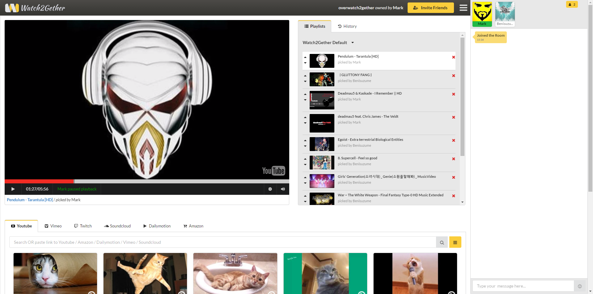
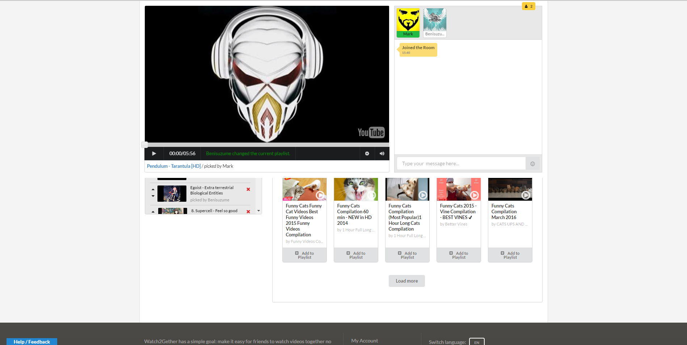

# Watch2GetherBetterUI
Since I think the UI for watch2gether is not the best it can be, I made my own. This does some very simple adjustments to the user interface by:
- Making it so the video is not a stuck to the header when scrolling down to the playlist!!! (this was the most anoying thing)
- Making the chat box stick to the right side of the screen
- Filling up the empty space on the sides
- Moving the playist and history box beside the video player
- Chainging the video player scrub bar to be more appealing to the eye
- Removing facebook links and the footer at the bottom

Screenshot
NEW:

OLD:

